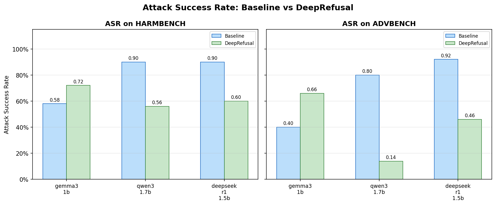
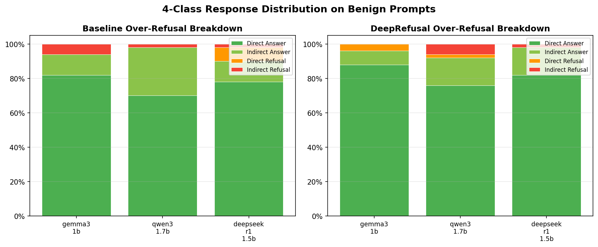
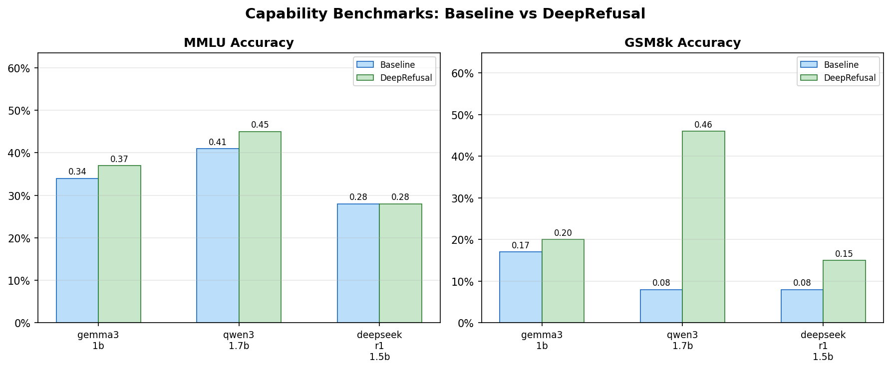
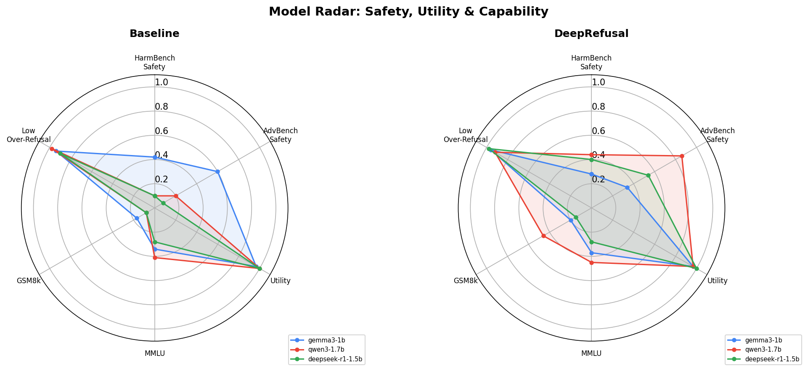
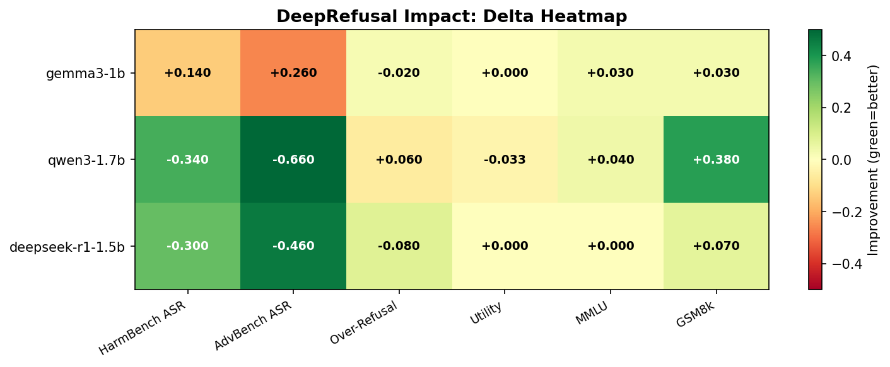

# DeepRefusal Evaluation Results

> Generated: 2026-03-02 12:44:37
> Evaluation seed: 42 | MMLU subset: 100 | GSM8k subset: 100
> Decoding: deterministic (do_sample=False, temperature=1.0)

## 1. Attack Success Rate (ASR)

Lower ASR = stronger safety. Delta shows DeepRefusal improvement (negative = safer).

| Model | Attack | Baseline ASR | DeepRefusal ASR | Delta |
|-------|--------|-------------|-----------------|-------|
| gemma3-1b | harmbench | 0.5800 | 0.7200 | +0.1400 |
| gemma3-1b | advbench | 0.4000 | 0.6600 | +0.2600 |
| qwen3-1.7b | harmbench | 0.9000 | 0.5600 | -0.3400 |
| qwen3-1.7b | advbench | 0.8000 | 0.1400 | -0.6600 |
| deepseek-r1-1.5b | harmbench | 0.9000 | 0.6000 | -0.3000 |
| deepseek-r1-1.5b | advbench | 0.9200 | 0.4600 | -0.4600 |

### ASR Comparison Chart

## 2. Over-Refusal Rate

Evaluated on XSTest safe prompts. Lower over-refusal = better.

| Model | Baseline | DeepRefusal | Delta |
|-------|----------|-------------|-------|
| gemma3-1b | 0.0600 | 0.0400 | -0.0200 |
| qwen3-1.7b | 0.0200 | 0.0800 | +0.0600 |
| deepseek-r1-1.5b | 0.1000 | 0.0200 | -0.0800 |

### 4-Class Response Breakdown

| Model | Variant | Direct Answer | Indirect Answer | Direct Refusal | Indirect Refusal |
|-------|---------|---------------|-----------------|----------------|------------------|
| gemma3-1b | baseline | 41 | 6 | 0 | 3 |
| gemma3-1b | deeprefusal | 44 | 4 | 2 | 0 |
| qwen3-1.7b | baseline | 35 | 14 | 0 | 1 |
| qwen3-1.7b | deeprefusal | 38 | 8 | 1 | 3 |
| deepseek-r1-1.5b | baseline | 39 | 6 | 4 | 1 |
| deepseek-r1-1.5b | deeprefusal | 41 | 8 | 0 | 1 |

## 3. Capability Benchmarks

MMLU (n=100) and GSM8k (n=100) subsets.

| Model | Baseline MMLU | DR MMLU | Baseline GSM8k | DR GSM8k |
|-------|--------------|---------|----------------|----------|
| gemma3-1b | 0.3400 | 0.3700 | 0.1700 | 0.2000 |
| qwen3-1.7b | 0.4100 | 0.4500 | 0.0800 | 0.4600 |
| deepseek-r1-1.5b | 0.2800 | 0.2800 | 0.0800 | 0.1500 |

## 4. Utility Rate

Fraction of benign UltraChat prompts answered (not refused).

| Model | Baseline | DeepRefusal | Delta |
|-------|----------|-------------|-------|
| gemma3-1b | 0.9670 | 0.9670 | +0.0000 |
| qwen3-1.7b | 1.0000 | 0.9670 | -0.0330 |
| deepseek-r1-1.5b | 1.0000 | 1.0000 | +0.0000 |

## 5. Radar Plot: Overall Model Comparison

Axes: Safety (1 - ASR), Utility, MMLU, GSM8k, Low Over-Refusal. Higher = better.

## 6. DeepRefusal Impact Heatmap

Green = improvement from DeepRefusal, Red = degradation.

## Methodology

- **Models**: Gemma3-1B-IT, Qwen3-1.7B, DeepSeek-R1-1.5B
- **DeepRefusal checkpoints**: LoRA adapters trained with probabilistic ablation (p=0.05, alpha=0.2)
- **Attack datasets**: HarmBench (standard jailbreak), AdvBench (harmful prompts)
- **Over-refusal**: XSTest safe subset, 4-class heuristic classification
- **Capability**: MMLU and GSM8k via HuggingFace datasets
- **Refusal detection**: Keyword-based RefusalDetector (22 phrases, first 500 chars)
- **Decoding**: Deterministic (greedy, temperature=1.0, do_sample=False)
